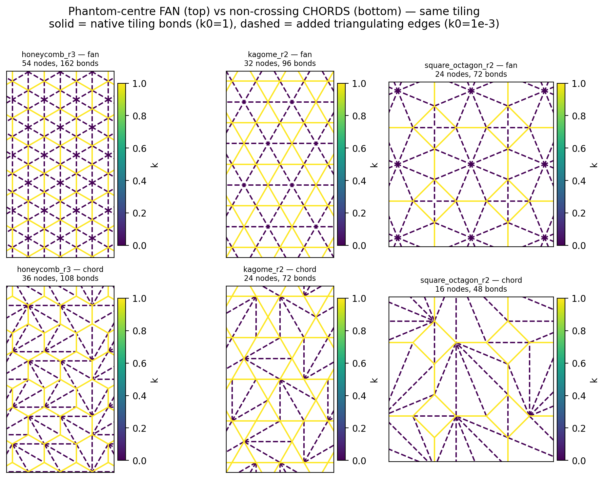

# Phantom-centre FAN vs non-crossing CHORDS — same tiling

**What.** Both are valid triangulations of the *same* native tiling, differing only in how the
non-triangular faces are filled. This figure makes the structural difference visible before anyone
switches the topology pool, because they are **physically different networks, not two drawings of
one**.

**Method.** `seeds.seed_tiling(name, reps, method=...)`, `method ∈ {'fan','chord'}` (default
`'fan'`, unchanged). Producer: `Phase 5/verifications/chord_vs_fan_figure.py`. Rendered through the
root `plotting.py` (`montage` → `draw_network`), per the settled plotting policy.

**Provenance.** commit at time of writing = the `_chord_and_tag` commit; no seeds involved (tilings
are deterministic constructions).

Reading the panels: **solid = the tiling's native bonds (`k0 = 1`), dashed = the added triangulating
edges (`k0 = 1e-3`)**. The fan's dashed edges converge on a phantom centre inside each face; the
chord's dashed edges span corner-to-corner and add no vertices.

## Counts

| tiling | method | nodes | bonds | triangles | native | added | Σareas / box |
|---|---|---|---|---|---|---|---|
| honeycomb_r3 | fan | 54 | 162 | 108 | 54 | 108 | 1.000000000 |
| honeycomb_r3 | **chord** | **36** | **108** | 72 | 54 | 54 | 1.000000000 |
| kagome_r2 | fan | 32 | 96 | 64 | 48 | 48 | 1.000000000 |
| kagome_r2 | **chord** | **24** | **72** | 48 | 48 | 24 | 1.000000000 |
| square_octagon_r2 | fan | 24 | 72 | 48 | 24 | 48 | 1.000000000 |
| square_octagon_r2 | **chord** | **16** | **48** | 32 | 24 | 24 | 1.000000000 |

Three things to read off it:

1. **The native edge count is IDENTICAL across methods** for every tiling (54/54, 48/48, 24/24) —
   as it must be, since the natives *are* the tiling. Only the added edges differ. That is the
   check that both methods triangulate the same object.
2. **The chord method keeps the tiling's own vertex set** — honeycomb_r3 is 36 nodes, the true
   honeycomb count, against the fan's 54. This is what matters for anything reasoning about the
   tiling's coordination, or feeding node counts to M2.
3. **Both tile the torus exactly once** (Σareas / box = 1.000000000), so neither leaves gaps or
   overlaps. *(For the old Delaunay chord split this ratio is 0.9537 on honeycomb_r3 — but note it
   is 1.000000 on kagome_r2 despite its 2 crossings, so this check is necessary, not sufficient;
   see `seeds._chord_and_tag`.)*

## Why the default was NOT switched

A soft **spoke** lets a face hinge; a soft **chord** must still carry that face's shear. So a chord
tiling with `k0 = eps` is a genuinely different mechanical network from a fan with `k0 = eps` — not
a re-drawing. The fan is also the representation `test_hex_closed_form` validates against the
analytic ν(r) to 4.4e-06. Which to use is a **modelling decision**, so `method='fan'` remains the
default and `'chord'` is opt-in.

## Limitations

- Three tilings shown (honeycomb, kagome, square_octagon); `square` is omitted from the figure
  because its faces are already quadrilaterals and the two methods differ trivially there.
- The panels are not square-framed for honeycomb/kagome because those unit cells are not square and
  `draw_network` holds aspect equal — geometrically honest, not a styling slip.
- No mechanical comparison here: this figure is purely structural. Comparing ν(θ)/E(θ) between the
  two representations would be a separate experiment, and is the natural follow-up if the pool is
  ever switched.

## Defect found and fixed while making this

The first render **contradicted its own caption**: `honeycomb_r3 — fan` and `square_octagon_r2 — fan`
drew every added edge SOLID. Cause: `plotting.draw_network`'s solid/dashed rule is
`k >= K0_FRAC · median(k)` — **median-relative**, so when the near-zero bonds are the MAJORITY (the
fan has twice as many spokes as natives) the median is itself ~`eps` and nothing dashes. The
equal-count cases (kagome fan, all chord panels) dashed correctly, which is why it was easy to miss.

Fixed by adding an optional explicit `solid=` mask to `draw_network` (and threading it through
`montage`); the default rule is unchanged, so no existing figure moves. **This was a latent bug in
the shared plotting module, not just in this figure** — any network whose soft bonds outnumber its
stiff ones was affected.
