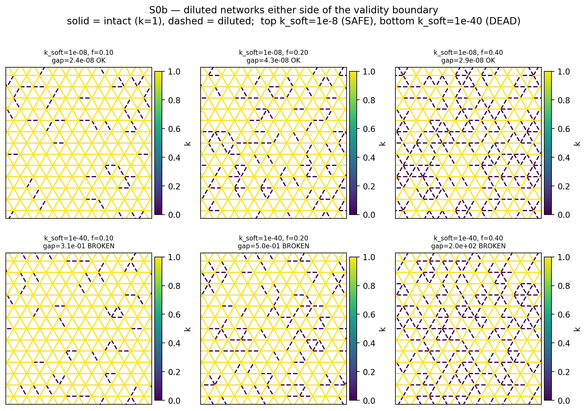

# S0b — the dilution validity boundary

**What.** Before letting bond dilution into M2's dataset (`M2_V2_PLAN.md` D8), map where the solver
and the independent sim stop agreeing, so dilution is sampled only where the labels are trustworthy.

**Method.** For each (base network, dilution fraction `f`, softness `k_soft`, seed): set a fraction
`f` of bonds to `k_soft`, leave the rest at `k = 1`, and compare the **solver**'s ν,E against the
**independent sim** (`physical_homog.virial_nuE` — a different code path, `CLAUDE.md` §3) on the
*same* network. 266 cases, all accepted by the sim.

**Producers.** `Phase 5/verifications/dilution_validity.py` (sweep) and
`dilution_networks_figure.py` (renders the networks; imports `build_diluted` from the sweep so the
two cannot drift). Bases: regular triangular and η=0.25 disordered, `half=5.0`. `f ∈ [0, 0.40]`,
`k_soft ∈ [1e-2 … 1e-40]`, 3 seeds.

---

## 1. The result — the boundary is in SOFTNESS, not in dilution fraction

```
k_soft >= 1e-8    ->  SAFE at every f tested, up to f = 0.40, on BOTH bases, all seeds
k_soft <= 1e-12   ->  BROKEN at the FIRST nonzero f (f_safe = 0.00)
```

| base | `k_soft` | largest `f` with **all** seeds at gap ≤ 0.05 |
|---|---|---|
| regular | 1e-2 … **1e-8** | **0.40** (the whole range tested) |
| regular | 1e-12, 1e-20, 1e-40 | **0.00** |
| eta0.25 | 1e-2 … **1e-8** | **0.40** |
| eta0.25 | 1e-12, 1e-20, 1e-40 | **0.00** |

It is a **sharp threshold between 1e-8 and 1e-12 in `k_soft`, essentially independent of `f`.**

**Two things this overturns about the intuition going in:**

1. **Dilution fraction is not the variable.** At `k_soft = 1e-8`, `f = 0.40` is fine — even though
   that puts live coordination at `z = 3.6`, **below the 2D isostatic point `z_c = 4`**. Being
   under-coordinated is not by itself a problem, because a bond at `1e-8` is still *carrying load*:
   the network is marginally rigid, not floppy, and both codes agree about it.
2. **The failure is NUMERICAL deadness, not a rigidity transition.** It appears when `k` underflows
   far enough that `A(s) = Σ_e (k_e/4ℓ_e²) q_e q_eᵀ` loses rank and the solver's regularised inverse
   is set by the regulariser rather than by physics.

**The boundary coincides with the project's own benign example.** `test_hex_closed_form` runs
`k_spoke = 1e-8` and matches the analytic ν(r) to 4.4e-06 — sitting exactly at the safe edge measured
here, from a completely different construction. That is an independent corroboration of the number.

## 2. Sign flips — the failure is not a small bias

**6 of 266 cases returned ν of the OPPOSITE SIGN** between solver and sim, all at `k_soft ≤ 1e-20`
and `f ≥ 0.30`:

| base | `k_soft` | `f` | `z` | solver ν | sim ν |
|---|---|---|---|---|---|
| regular | 1e-20 | 0.40 | 3.60 | **−0.2314** | **+1.0815** |
| regular | 1e-40 | 0.30 | 4.20 | **−0.1885** | **+0.9863** |
| eta0.25 | 1e-20 | 0.40 | 3.60 | +0.0389 | −1.3646 |
| eta0.25 | 1e-20 | 0.40 | 3.60 | −0.2303 | +1.1593 |
| eta0.25 | 1e-20 | 0.40 | 3.60 | +0.0126 | −2.2099 |
| eta0.25 | 1e-40 | 0.40 | 3.60 | +0.1359 | **−9.9180** |

A model trained on those labels would learn *auxetic* where the truth is strongly *positive*. Worst
observed gap **2.0e+02**, and one panel shows the solver returning ν ≈ 1750.

## 3. The failure is INVISIBLE



Top row `k_soft = 1e-8` (safe, gap ~1e-8), bottom row `k_soft = 1e-40` (broken, gap 0.31 → 200).
**The two rows are structurally indistinguishable** — same dilution fraction, same visual disorder,
same connectivity class. The only difference is the numerical value on the dashed bonds.

**Consequence: no geometric health gate can catch this.** `require_healthy_mesh` inspects triangle
areas and shape; every one of these meshes is geometrically fine. The failure lives entirely in the
`k` values, which is why it had to be measured rather than screened.

## 4. Incidental — dilution stresses the B-1 KKT solve

The B-1 guard (added 2026-08-24) **fired repeatedly during this sweep**, e.g.
`orthogonality 2.9e-03 → 6.3e-05, W changed by 2.7e-01`. Its baseline rate is ~1 in 532 solves; here
it fires far more often. So the dilute regime is *also* where the intrinsic KKT solve is most
fragile — an independent reason to bound `k_soft`, and a hint that dilution would be a good stress
test for any future work on B-1.

## 5. Decision for M2

- **Sample dilution with `k_soft ≥ 1e-8`** (contrast ≤ 1e8) — the full `f ∈ [0, 0.40]` range is then
  usable, including the sub-isostatic part, which is the physically interesting region.
- **Do not sample below `k_soft = 1e-12`** with solver labels. If that region is ever wanted, label
  it with the **sim** (and note the sim's own reliability there is untested).
- This bounds `M2_V2_PLAN.md` §3.1h's **contrast** knob, which was the one axis flagged to "ramp last
  and most carefully".

## 5b. WHY 1e-8? It is the solver's REGULARISER, and the number is predicted

*(`dilution_regulariser_check.py`, 2026-08-25 — the user asked whether the boundary makes sense as a
matrix-singularity effect. It does, quantitatively.)*

`_woodbury_solve_aw` inverts the bare tensor with a RELATIVE regulariser:

```python
eps   = 1e-12 * A3.abs().max()      # GLOBAL max over all triangles
A_inv = inv(A3 + eps * I3)
```

With `|q_e| ~ ℓ²` and the prefactor `k_e/4ℓ_e²`, the eigenvalues of `A(s)` scale as `k_e ℓ²/4`. A
triangle carrying a diluted bond has an eigenvalue `≈ k_soft ℓ²/4`; `eps` is set by the STIFF
triangles at `≈ 1e-12 ℓ²/4`. So the regulariser overwhelms physics when

```
k_soft · ℓ²/4  ≲  1e-12 · ℓ²/4      ⇒      k_soft ≲ 1e-12          (the ℓ² CANCELS)
```

**The cancellation predicts a geometry-independent threshold — which is why §1 measured the SAME
boundary on the regular and η=0.25 bases.**

Measured, rebuilding `A(s)` independently via `metric_ops.bare_tensor`:

| base | `k_soft` | `eps` | `min λ` | **frac(λ < eps)** |
|---|---|---|---|---|
| regular | 1e-08 | 9.375e-14 | 4.687e-10 | **0.000** |
| regular | 1e-10 | 9.375e-14 | 4.687e-12 | **0.000** |
| regular | **1e-12** | 9.375e-14 | 4.687e-14 | **0.212** |
| regular | 1e-20 | 9.375e-14 | **−1.544e-18** | 0.229 |

`λ_min ≈ 0.5 · k_soft · max|A|` holds over **eight decades**, so `λ_min = eps` gives
**`k_soft_crit = 2e-12`** — and the jump is measured between 1e-10 (0.000) and 1e-12 (0.212).
For η=0.25 the geometric factor is 0.093, predicting `k_soft_crit ≈ 1.1e-11`; it too breaks between
1e-10 and 1e-12. **Prediction and measurement agree on both bases.**

**So the S0b boundary is NOT a physics threshold — it is the hard-coded `1e-12`.**

**A third regime appears below that.** At `k_soft ≤ 1e-20`, `λ_min` goes NEGATIVE (−1.5e-18) and
*saturates* — identical at 1e-20 and 1e-40 — because below ~1e-16 the soft contribution is lost in
the round-off of the assembly itself (`max|A| ≈ 0.1`, float64 precision 1e-16). `A(s)` is then not
even numerically positive-definite.

| `k_soft` | what governs `A⁻¹` |
|---|---|
| **> 2e-12** | physics — regulariser negligible |
| 2e-12 … ~1e-16 | **the regulariser `eps`**, not physics |
| < ~1e-16 | assembly round-off; `A(s)` numerically indefinite |

**Consequences.** The `k_soft ≥ 1e-8` bound has **~4 orders of margin** over the true crossover
(and coincides with `test_hex_closed_form`'s benign `k_spoke = 1e-8`); it could be relaxed to 1e-10
with two orders if more contrast is ever wanted. And it is **falsifiable**: changing the regulariser
constant must move the boundary proportionally — the clean causal test, requiring a protected-core
change. **Deferred as LOW PRIORITY (user, 2026-08-25):** the evidence is already triple-confirmed
(scaling over 8 decades; the measured jump; and two bases whose *different* prefactors each match
their own prediction), and the `k_soft ≥ 1e-8` bound does not depend on it.

**The spin-off that IS worth something.** `eps` uses a **GLOBAL** max over all triangles, so a soft
triangle is regularised against the stiffest triangle anywhere in the mesh. A **per-triangle**
relative regulariser `eps_s = 1e-12 · |A(s)|max` would scale with each triangle's own magnitude and
would not swamp the soft ones — plausibly pushing this boundary down by many orders and **widening
the solver's usable domain**. That is a capability change, not a confirmation, and it is the version
worth doing if any. (Protected core; would need the full gate set.)

*Caveat:* the 5-component → 3×3 unpacking used here reconstructs the shear-entry factor. The
`λ_min ∝ k_soft` scaling and the crossover location are robust to an O(1) error there; the exact
`2e-12` could shift by an O(1) factor. The measured `frac(λ<eps)` transition is the solid part.

## 5c. EXTENSION 2026-08-25 — small cells: the bound holds in the BULK, and FAILS in the TAIL

**⚠ This section was CORRECTED the same day it was written. The first version overstated it; the
correction is the substantive content, so both are kept.**

**What was asked.** §6 below notes that this sweep used two bases at one size (`half = 5.0`) and that
the threshold could move with size. M2 dataset work needed dilution on the small unit cells of
`seeds.seed_cells` (N = 3…12 basis nodes, 6…24 triangles) — a base class an order of magnitude
smaller, where one diluted bond is a much larger fraction of the network.

**First measurement (correct, but under-powered).** 16 of 16 cases agreed with the independent sim
to four decimal places — cells N = 3, 5, 8, 12 crossed with f = 0.1…0.4 at `k_soft = 1e-6`,
including live coordination z = 3.33…3.67, i.e. **below** the isostatic point. Relative gap 0.000
throughout.

**What I wrongly concluded from it:** *"the `k_soft ≥ 1e-8` bound transfers to the small-cell regime
unchanged."* Those 16 draws all landed at |ν| ≤ 1.06. **They never sampled the near-mechanism tail**,
and the conclusion was generalised as though they had.

### The tail is where it breaks

Regenerating the same regime and selecting for |ν| > 5:

| cell | f | `min_eig` | ν solver | ν sim | |
|---|---|---|---|---|---|
| N3 | 0.4 | 1.59e-06 | **−7.82** | **+1.07** | opposite sign |
| N4 | 0.3 | 2.29e-06 | −18.59 | −18.59 | agrees exactly |
| N4 | 0.3 | 2.26e-06 | **−94.18** | **+0.55** | opposite sign, ×170 |
| N5 | 0.4 | 2.82e-06 | −26.88 | −26.88 | agrees exactly |

**2 of 6 disagree — and no scalar health metric separates them.** The two N4 rows have essentially
the same `min_eig` (2.29e-06 vs 2.26e-06); one is exact and one is wrong by a factor of 170. Neither
`min_eig`, nor `E`, nor the geometric health gate, nor the `k_soft` bound distinguishes a good label
from a bad one here. **The only thing that does is running the other code path.**

Measured rate over a whole diluted population (M2 smoke build, 172 diluted samples, gap on the full
bulk tensor against `sim_bulk_C6` → `physical_homog.virial_C`): **12 flagged, 6.98 %**, median gap
0.210, max 0.565.

### The corrected statement

- `k_soft ≥ 1e-8` remains **necessary** and remains correct as a bound on numerical deadness (§5b's
  root cause is unaffected — the regulariser is relative, so the geometric prefactor cancels and
  that crossover really is size-independent).
- It is **not sufficient**. In the near-mechanism tail — reachable on small, heavily diluted cells —
  solver and sim diverge at a rate of ~7 %, with sign errors, while every parameter and health
  metric looks fine.
- Therefore **dilution labels must be cross-checked per sample against the independent sim**, which
  is what `M2_V2_PLAN.md` §3.1g asked for all along ("bounded — health-gated, and **cross-checked
  against the independent sim far more densely than elsewhere**"). That requirement was skipped in
  the first M2 build and is now implemented in `Phase 5/m2/build_dataset.py: sim_check`; samples are
  FLAGGED (`sim_ok`, `sim_gap`), never dropped, and the trainer filters.

**The generalisable lesson:** a validity boundary established on the *bulk* of a regime does not
transfer to its *tail*, and 16 agreeing draws that never enter the tail are not evidence about it.
Sample the failure mode you are trying to bound, not the comfortable middle of the range.

## 6. Limitations

- Two bases only (regular, η=0.25) at one size (`half = 5.0`). The threshold could move with size or
  with strongly anisotropic bases.
- Dilution here is **uniform-random** over bonds. Structured dilution (a percolating cluster, a
  crack, orientation-selective removal) is a different and probably harsher test — untested.
- `gap` is computed on the **scalar** ν,E pair, not the full ν(θ),E(θ) profile, so it may understate
  directional disagreement.
- **The sim's own validity in the dead regime is not established.** Below the threshold both codes
  may be wrong; this experiment shows they *disagree*, not which one is right. A third path (analytic
  or a converged nonlinear relaxation) would be needed to settle that — worth remembering before
  treating the sim as truth at `k_soft = 1e-40`.
