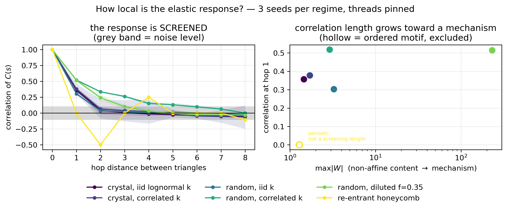

# How local is the elastic response? — the receptive-field question, and what to label

**What.** Two questions the M2 v2 design rests on, neither of which had been measured:

1. **Can a finite-hop GNN capture `W` at all?** `M2_V2_PLAN.md` §3.1c flags this as the plan's
   biggest architectural risk and states it as a *prediction*: `W` comes from a **global**
   constrained solve (edge compatibility + zero discrete Gaussian curvature couple the whole cell,
   Poisson-like), while message passing sees only `n_layers` hops. The surrogate can capture `W`
   only insofar as the response is **screened** over a finite correlation length — and accuracy
   should degrade with cell size, fastest near a mechanism, where that length diverges.
2. **How much signal does a bulk-only label discard?** The §2.1 head predicts per-triangle `C(s)`
   and averages to `C_eff`, but §3.3 labels only the bulk `C6`.

**Producer.** `Phase 5/verifications/m2_locality.py` → `locality.csv`, `locality.png`.
Threads pinned to 1 (D4); 3 seeds per regime; `torch` 2.12.1+cpu, float64.

**Method.** Triangles are adjacent iff they share a bond. BFS the hop distance between every pair,
standardise the per-triangle `C(s)`, and average the correlation over the 6 tensor components and
over seeds.

---

## 1. Result — correlation of `C(s)` vs hop distance

```
regime                      n_tri   max|W|      0      1      2      3      4      5      6      7      8
crystal, iid lognormal k       96      1.5   1.00   0.36   0.04   0.01  -0.01  -0.03  -0.03  -0.04  -0.05
crystal, correlated k          96      1.7   1.00   0.38   0.06   0.04   0.02  -0.01  -0.05  -0.05  -0.06
random,  iid k                228      3.3   1.00   0.30   0.03   0.02   0.00   0.01   0.00  -0.01  -0.03
random,  correlated k         228      2.9   1.00   0.52   0.33   0.26   0.15   0.13   0.10   0.06  -0.00
random,  diluted f=0.35       228    231.4   1.00   0.51   0.24   0.10   0.03  -0.01  -0.03  -0.03  -0.03
re-entrant honeycomb          192      1.3   1.00   0.00  -0.50  -0.00   0.25  -0.00  -0.00   0.00  -0.11
```



## 2. Reading it — three distinct behaviours, and only one of them is screening

**(a) Intrinsic screening is SHORT: 2–3 hops.** With an i.i.d. `k` field — so the *input* carries no
spatial correlation — `C(s)` is at noise level by hop 2 on both the crystal (0.36 → 0.04) and the
disordered patch (0.30 → 0.03). **This is the quantity §3.1c is about**, and it is short.

**(b) The long tail under a correlated `k` field is INHERITED, not intrinsic.** `random, correlated k`
decays much more slowly (0.52 → 0.33 → 0.26 → 0.15, reaching noise only near hop 7–8). That is not a
screening failure: the imposed `k` field has its own correlation length and `C(s)` inherits it.
**A GNN sees those `k` values as local inputs**, so output correlation that comes from input
correlation costs it nothing. Distinguishing (a) from (b) is the whole point of sampling the
correlation-length knob (§3.1f) rather than only white noise.

**(c) The ordered motif OSCILLATES rather than decaying** — 1.00, 0.00, −0.50, 0.00, +0.25 for the
re-entrant honeycomb. That is the motif's own periodicity (rib triangles and fan-spoke triangles
alternate on a fixed pattern), not long-range coupling. A periodic pattern is locally determined, so
a finite receptive field reproduces it exactly. **It must not be read as a correlation length.**

## 3. Consequences

**The receptive field is adequate — measured, not assumed.** The intrinsic screening length is 2–3
hops, and 4 hops even in the near-mechanism diluted case (`max|W|` = 231, i.e. non-affine response
two orders above the applied strain). The planned `n_layers ≈ 4–5` covers it. **This retires the
plan's biggest architectural risk**, which until now was an argument rather than a number.

**The predicted mechanism trend is visible but has NOT bitten.** §3.1c predicts the length diverges
toward a mechanism. Hop-1 correlation does rise with disorder and softness (0.30 i.i.d. → 0.51
diluted), but the diluted case still reaches noise by hop 4. So the direction is confirmed and the
magnitude is not yet a problem in the sampled regime. Pushing dilution further is the natural stress
test — bounded by S0b's `k_soft ≥ 1e-8`.

**Per-triangle labels are worth ~20× in effective signal, not ~200×.** A 2-hop ball holds ~10
triangles, so a 228-triangle network supplies **~23 effectively independent** local samples, not 228.
Against **1** for a bulk-only label, that is still a large gain — and it comes from labels the solver
already computes.

**Bulk-only supervision lets local errors cancel.** Averaging 228 per-triangle predictions into 6
numbers means one triangle too stiff and another too soft scores zero loss: many wrong local fields
produce the right mean. Counting numbers, over five representative networks a bulk label is 30
numbers against **4176** per-triangle — ~139× — and the per-triangle field is genuinely structured
(on a correlated-`k` patch, `C_xxxx` spans 0.0052–0.2041 about a bulk of 0.0575, spread/mean 0.73),
not the bulk repeated.

## 4. Limitations

- **Correlation of `C(s)` is a proxy for what a GNN must learn, not the thing itself.** A model could
  in principle need a longer receptive field than the correlation length suggests. This bounds the
  problem; it does not prove a 4-layer model succeeds. That is S1/S3's job.
- **One size per regime** (96–228 triangles). §3.1c's prediction is about growth *with cell size*,
  and this does not sweep size. A held-out large-size bin (500–1000 nodes) remains the real test.
- **The near-mechanism regime is sampled only via uniform-random dilution** at `f = 0.35`. Structured
  dilution (a percolating cluster, a crack) is a different and probably harsher test, exactly as
  `DILUTION_VALIDITY.md` §6 notes.
- **A perfect crystal at uniform `k` cannot be measured this way at all** — `W ≡ 0` and every `C(s)`
  is identical, so there is no variation to correlate. An earlier version of this script standardised
  that float noise and reported a hop-0 correlation of **0.91** where it must be exactly 1; the
  regime is now detected and excluded (`var_tol` in `correlation_vs_hop`). Worth stating because the
  row looked like a measurement.
- Correlations are averaged over the six `C6` components equally; individual components may screen at
  different rates, which is not resolved here.
