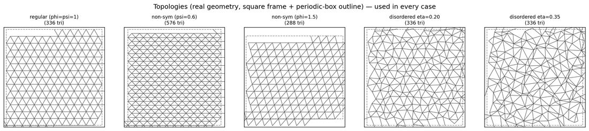
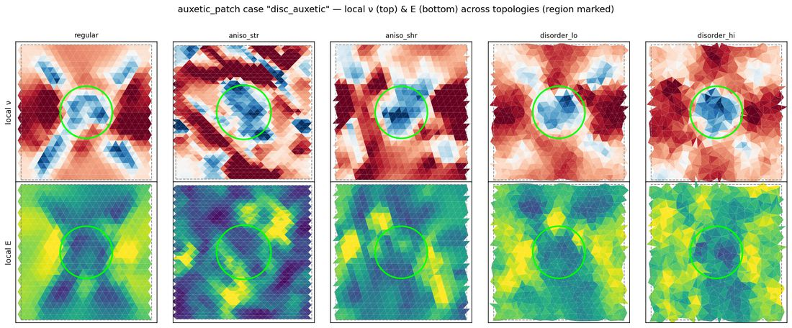
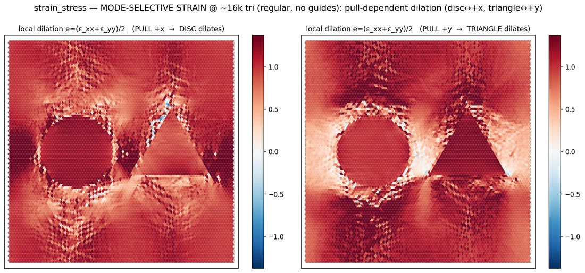
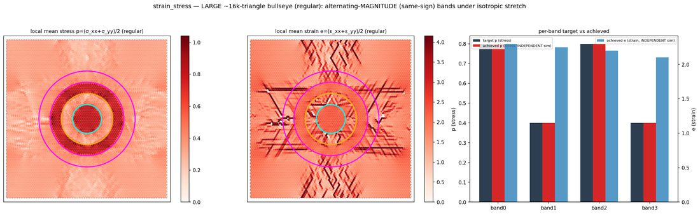
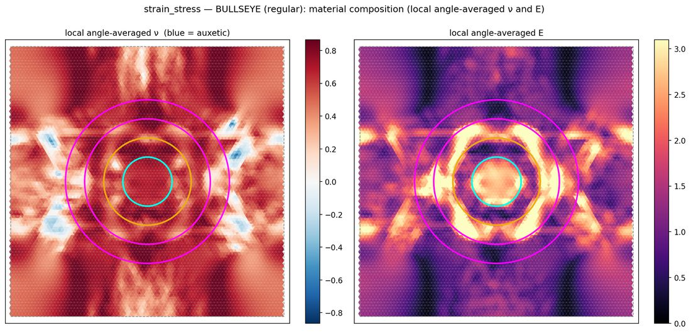

# MATERIALIZE — Differentiable Inverse Design of 2D Mechanical Metamaterials

**Complete reference for future users.** This document explains the framework (theory, with the
governing equations written out), the code (architecture, the algorithm of each major function, and
the variables it takes), and how to use it (worked, runnable examples with pictures). It is an
**instruction-and-explanation** document; it is meant to be read start-to-finish once, then used as a
reference. Companion file: [`FUTURE_DIRECTIONS.md`](FUTURE_DIRECTIONS.md) (roadmap, ranked).

> Every symbol is collected in the [Notation](#0-notation--symbols) table below and defined again at
> first use. Mathematical expressions render via MathJax in the PDF build.

---

## Table of contents

0. [Notation & symbols](#0-notation--symbols)
1. [What MATERIALIZE is](#1-what-materialize-is)
2. [The physical system](#2-the-physical-system)
3. [The framework: the geometric (D2C) homogenisation](#3-the-framework-the-geometric-d2c-homogenisation)
4. [Toward incompatible elasticity (residual stress) — theory, ready](#4-toward-incompatible-elasticity-residual-stress--theory-ready)
5. [Repository layout](#5-repository-layout)
6. [Phase 2 — the differentiable forward solver](#6-phase-2--the-differentiable-forward-solver)
7. [Phase 3 — inverse design](#7-phase-3--inverse-design)
8. [Worked examples (with pictures)](#8-worked-examples-with-pictures)
9. [The verification suite](#9-the-verification-suite)
10. [Conventions, units, and caveats](#10-conventions-units-and-caveats)
11. [Quick API reference](#11-quick-api-reference)

---

## 0. Notation & symbols

Notation follows Grossman & Boudaoud, PRR 2026 (arXiv:2309.07844). Indices $\mu,\nu,\alpha,\beta \in
\{x,y\}$ are metric/tensor components; a triangle is indexed by $s$, a bond/edge by $e$ or $b$, an
interior vertex by $v$.

| symbol | meaning |
|---|---|
| $n$ | number of vertices (nodes); $2n$ positional degrees of freedom |
| $N$ | number of triangles |
| $E_\text{int}$, $n_\text{int}$ | number of interior edges / interior vertices |
| $k_e$ (code `k`) | spring **stiffness** of edge $e$ — the primary **design variable** |
| $\ell_e$ | reference (rest) **length** of edge $e$; $\ell_{0,e}$ (code `l0`) the rest length as a design variable |
| $\Delta x_e$ | reference **edge vector** of edge $e$ (a 2-vector); $\ell_e=\lVert\Delta x_e\rVert$ |
| $q_e$ | rank-1 **edge carrier** $q_e^{\mu\nu}=\Delta x_e^{\mu}\Delta x_e^{\nu}$ (a symmetric 2×2, i.e. a vec3 in Voigt) |
| $S_s$ | reference **area** of triangle $s$ |
| $g(s)$ | the 2×2 **metric** of triangle $s$ |
| $\bar g$ | **reference metric** (the metric $\ell_0$ encodes); here $\bar g = I$ (flat, unstressed). §4 generalises — a general $\bar g$ need **not** be a zero-energy "rest" state |
| $\Delta g$ (code `load`) | the **applied macroscopic strain** (uniform affine metric change); a vec3 $[xx,xy,yy]$ |
| $\delta g(s)$ | the **non-affine fluctuation** of triangle $s$'s metric (the unknown of the homogenisation) |
| $W(s)$ (code `W`) | per-triangle **strain-concentration operator**: $\delta g(s)=W(s)\,\Delta g$ (9 comps/triangle) |
| $A(s)$ (code `bare`) | per-triangle **bare elastic tensor** = the spring-energy metric Hessian $H_s$ (below) |
| $H_s$ | $H_s=\sum_{e\in s}\frac{k_e}{4\ell_e^2}\,q_e q_e^{\!\top}$ — the 3×3 (Voigt) form of $A(s)$ |
| $C(s)$ (code `per_triangle`) | per-triangle **actual** tensor $(\,\mathbb 1+W(s))^{\!\top}A(s)(\mathbb 1+W(s))$ |
| $C_\text{eff}$ (code `elastic_tensor`) | the **homogenised** effective tensor (a symmetric 3×3 = 6 comps) |
| $\nu$ (code `poisson`), $E$ (code `young`) | Poisson ratio, Young's modulus (contractions of $C_\text{eff}$) |
| $\nu(\theta), E(\theta)$ | the **directional** Poisson ratio / modulus at in-plane angle $\theta$ |
| $J$ | edge-compatibility matrix ($E_\text{int}\times 3N$), multiplier $\lambda$ |
| $\mathcal C$ | discrete **curvature / incompatibility** operator ($n_\text{int}\times 3N$), multiplier $\kappa$ |
| $M_S$ | area-weighted-mean matrix ($3\times 3N$), multiplier $\chi$ |
| $\Pi$ | compatibility map $\delta g=\Pi u$ from node displacements $u\in\mathbb R^{2n}$ (proof only) |
| $\mathbb 1, I$ | identity |

**Voigt / vec3 convention.** Symmetric 2×2 tensors are stored as `vec3 = [xx, xy, yy]` **with no
factor-of-2 on the shear component**. The framework's native strain is the **metric change**
$\Delta g = F^{\!\top}F - I$ (with $F$ the deformation gradient) — the geometrically exact measure,
*not* the linearised engineering strain $\operatorname{sym}(\nabla u)$.

---

## 1. What MATERIALIZE is

MATERIALIZE designs **2D mechanical metamaterials** — planar spring networks whose *effective*
elastic behaviour (Poisson ratio $\nu$, modulus $E$, the full tensor, and *spatial patterns* of them)
is prescribed by the user and realised automatically by tuning per-bond stiffnesses.

The workflow is **inverse design by gradient descent** through a differentiable homogeniser:

```
   ┌──────────────┐   forward()          ┌──────────────┐
   │ bond stiff-  │ ───────────────────► │  effective   │
   │ nesses  k    │   (Phase 2 solver,   │  response    │
   │ (variables)  │ ◄─────────────────── │  ν, E, C_eff │
   └──────────────┘   ∂(response)/∂k     └──────────────┘
          ▲             (adjoint)                │
          │                                      ▼
   L-BFGS update  ◄──────  loss = Σ ‖achieved − target‖²  (Phase 3)
```

Two components are the heart of the project:

- **A differentiable forward solver** (Phase 2): network → homogenised elastic tensor, differentiable
  w.r.t. every bond stiffness, at any mesh size.
- **An inverse-design engine** (Phase 3): turns "$\nu=-0.5$ here, stiff there, isotropic elsewhere"
  into concrete bond stiffnesses using that solver's gradients.

Every design is **independently verified**: after the optimiser produces a network, a *separate*
NumPy simulation (periodic relaxation → virial/energy homogenisation) confirms it behaves as
designed. Design path and verification path are genuinely different code, so agreement is meaningful.

The forward model is the **"Disc-to-Continuum" (D2C)** homogenisation of Grossman & Boudaoud — a
*geometric / metric* formulation of discrete elasticity (Section 3).

**The lattice topologies** the framework designs on (regular crystal, two anisotropic crystals, two
disorder levels):



---

## 2. The physical system

A design is a **2D triangulated spring network**:

- **Nodes** — points in the plane (a triangular lattice, optionally perturbed/disordered; periodic or
  open).
- **Triangles** — the Delaunay triangulation of the nodes; the elastic response is assembled *per
  triangle*.
- **Bonds (springs)** — triangle edges. Each bond $b$ has a **stiffness** $k_b>0$ (the design
  variable) and a **rest length** $\ell_{0,b}$ (a second, optional variable). A bond shared by two
  triangles carries a single consistent $k$ (design variables are **per-bond**).

The spring energy under a deformation is $\tfrac12\sum_b k_b(\ell_b-\ell_{0,b})^2$. The forward solver
answers: *given the network, what is its homogenised effective elastic tensor?* — the inverse engine
asks the reverse.

Topologies (`_common.make_topology`): `regular` ($\varphi=\psi=1$), `aniso_str`/`aniso_shr`
(anisotropic crystals), `disorder_lo`/`disorder_hi` (positional disorder $\eta=0.20/0.35$). Size is a
half-width $N$: $N{=}14\approx 2.7$k triangles, $N{=}42\approx 16$k.

---

## 3. The framework: the geometric (D2C) homogenisation

This section is the conceptual core; it also writes out the governing equations.

### 3.1 Metric, not displacement

Classical discrete elasticity is a **displacement** theory: the unknown is the nodal displacement
$u$; you assemble a global stiffness $K(k)$, solve equilibrium $K u = f$ for where nodes go, and
*measure* the modulus from the solved field.

D2C is a **metric** theory. The primary object is the discrete **metric change** per triangle,
$\Delta g(s) = F(s)^{\!\top}F(s)-I$ (Voigt vec3 $[g_{xx},g_{xy},g_{yy}]$) — the intrinsic geometry —
and **node displacements never appear** in the solve. Each triangle's bare tensor $A(s)$ is a
*closed-form* function of its geometry and stiffnesses (no solve to get the material). The
homogenisation is a **compatibility** problem, not an equilibrium solve.

```
   CLASSICAL (displacement)                 D2C (metric)
   ────────────────────────                 ─────────────────────────
   unknown:  u  (node displ.)               unknown:  δg(s) (per-tri metric)
   strain  = sym(∇u)  [compatible           strain  = FᵀF − I  [EXACT; compatibility
             by construction]                          imposed explicitly]
   solve:   K u = f   (equilibrium)         solve:   min energy s.t. compatibility
   read modulus off the solved u            read C_eff directly from the operator W
```

### 3.2 Linear in energy, exact in geometry

A crucial, often-misread point:

> The D2C formulation is **linear in ENERGY, not in GEOMETRY.**

The strain measure $\Delta g = F^{\!\top}F-I$ is the full, geometrically **exact** metric change (it
contains the quadratic term in $\nabla u$) — *not* the linearised $\operatorname{sym}(\nabla u)$. The
only linearisation is the **constitutive law**: the elastic energy is a *quadratic* form in that
exact metric strain (a linear stress–strain relation).

| method | kinematics (geometry) | constitutive (energy) |
|---|---|---|
| linear FEM | linearised $\operatorname{sym}\nabla u$ | quadratic |
| nonlinear FEM | exact | can be nonlinear |
| **D2C (this)** | **exact ($F^{\!\top}F-I$)** | **quadratic (linear)** |

Consequence: the strain-concentration operator $W(s)$ is a *linear-response* operator (linear because
the *energy* is quadratic), but the kinematics behind it are exact. Do **not** describe $W$ as "the
geometry being linearised."

### 3.3 One solve gives the whole response operator ("direct")

The solver does **not** answer "what happens under this one load." It solves, once, for the
strain-concentration field $W(s)$ — the *complete* linear map from any macroscopic strain to each
triangle's local metric response, $\delta g(s)=W(s)\,\Delta g$. From that single object fall, with
no further solves: the homogenised tensor $C_\text{eff}$ (all components at once), the directional
$\nu(\theta),E(\theta)$ at **every** angle, and the per-triangle strain/stress under **any** load.

This is why the framework is best described as **direct** rather than merely "fast": the material is a
closed-form read-off per triangle, the full response operator is the primary output, and its gradient
w.r.t. the design variables is immediate (no adjoint of a global displacement solve). It is *also* why
targeting local per-element strain/stress (Section 7.4) is natural here and awkward in a displacement
code — the operator you need is already the output.

Because $\nu$ and $E$ are both contractions of the *same* $C_\text{eff}$, they are **coupled** — they
cannot be prescribed fully independently (realizability, Section 7).

### 3.4 The governing equations

**Energy** (loading $\Delta g$ fixed; minimise over the fluctuation field $\delta g$):
$$
E[\delta g] \;=\; \tfrac12 \sum_s A(s)^{\mu\nu\alpha\beta}
\bigl(\Delta g+\delta g(s)\bigr)_{\mu\nu}\bigl(\Delta g+\delta g(s)\bigr)_{\alpha\beta},
\qquad
A(s)\ \leftrightarrow\ H_s=\sum_{e\in s}\frac{k_e}{4\ell_e^2}\,q_e q_e^{\!\top}.
$$

Minimisation is subject to **three intrinsic constraints** (these are what make the fluctuation field
physically realisable):

**(C1) Edge compatibility.** Adjacent triangles sharing edge $\Delta x_e$ must agree on its length:
$$
\bigl[\delta g(s_1)-\delta g(s_2)\bigr]_{\mu\nu}\,\Delta x_e^{\mu}\Delta x_e^{\nu}=0
\quad\Longleftrightarrow\quad J\,\delta g = 0 .
$$

**(C2) Zero discrete Gaussian curvature (compatibility / incompatibility).** Edge agreement alone is
*not* full compatibility — a field can match every shared edge length yet fail to assemble into a flat
sheet (the vertex angle-sums do not close). The missing condition, at each interior vertex $v$, is
that the linearised change of the angle sum vanish:
$$
(\mathcal C\,\delta g)_v \;:=\;
\sum_{s\ni v} a^{(s)}_v{}^{\mu\nu}\,\delta g(s)_{\mu\nu}=0,\qquad
a^{(s)}_v{}^{\mu\nu}=\frac{\partial\theta^{(s)}_v}{\partial g(s)_{\mu\nu}},
$$
with $\theta^{(s)}_v$ the interior angle triangle $s$ contributes at $v$. This is the discrete
$\operatorname{inc}(\delta g)=0$ (St-Venant) condition; $\kappa_v$ is its multiplier (a discrete Airy
stress potential). **Omitting (C2) is exactly the classic mean-field error** — it minimises over a
space $\approx n_\text{int}$ dimensions too large (incompatible fields with spurious disclinations),
giving a $\approx 1.4\times$ over-compliance.

**(C3) Area-weighted normalisation.**
$$
\boxed{\ \sum_s S_s\,\delta g(s)_{\mu\nu}=0\ }\qquad\Longleftrightarrow\qquad M_S\,\delta g=0 .
$$
The *unweighted* mean $\sum_s\delta g(s)=0$ (used by the old single-site mean field) is **wrong**: it
over-constrains the realisable fields. The area-weighted mean is a discrete divergence-theorem
identity ($\sum_s S_s\,\varepsilon(s)\equiv 0$ for any periodic displacement field) — it is *implied
by* compatibility, hence harmless, whereas the plain mean injects an inconsistent constraint.

**The KKT system.** Stacking $\delta g\in\mathbb R^{3N}$ and $A=\operatorname{blkdiag}(A(s))$ (note:
**block-diagonal** — the global coupling lives in the constraints, not in a mean-field $A-B$):
$$
\begin{pmatrix} A & J^{\!\top} & \mathcal C^{\!\top} & M_S^{\!\top}\\ J&0&0&0\\ \mathcal C&0&0&0\\ M_S&0&0&0\end{pmatrix}
\begin{pmatrix}\delta g\\ \lambda\\ \kappa\\ \chi\end{pmatrix}
=\begin{pmatrix}-A\,\Delta g_\text{rep}\\ 0\\ 0\\ 0\end{pmatrix}.
$$
The driving term $-A\,\Delta g_\text{rep}$ is the affine pre-stress ($\Delta g$ replicated on
every triangle). Because everything is linear in $\Delta g$, **stripping it** yields the
loading-independent response operator $W$ directly (replace the RHS $-A\,\Delta g_\text{rep}\to
-A$ and $\delta g\to W$). This is the "solve once, get the whole operator" of Section 3.3.

**Homogenisation** (Section 3.5): the **unweighted** mean of the per-triangle actual tensors,
$$
C_\text{eff}=\frac1N\sum_s \bigl(\mathbb 1+W(s)\bigr)^{\!\top}A(s)\bigl(\mathbb 1+W(s)\bigr).
$$

### 3.5 Homogenisation is the *unweighted* mean

The final effective tensor is the **unweighted** per-triangle mean of $C(s)$ — the true physical
(energy = virial) modulus. ($A(s)$ carries no area prefactor, so the total energy is an unweighted
*sum* and its $\Delta g$-Hessian is the unweighted mean.) An area weight *is* used in the
compatibility normalisation (C3), where it is correct; it is **not** used in the final average, where
it would bias $\nu$ on disordered/anisotropic meshes. Verified against virial and energy-Hessian
ground truths (`verification_tools/physical_homog.py`). `physical_units=True` additionally rescales
$C_\text{eff}\to C_\text{eff}\cdot 8N/\sum_s S_s$ to physical stress units ($\nu$ is scale-invariant).

### 3.6 Why it is correct (one line)

Let $\Pi$ map node displacements to metric fluctuations, $\delta g=\Pi u$. Compatibility gives
$J\Pi=0$, $\mathcal C\Pi=0$ *and* $M_S\Pi\equiv 0$ (the divergence identity, verified to
$\lVert M_S\Pi\rVert/\lVert\Pi\rVert=1.6\times10^{-16}$). Hence
$\ker[J;\mathcal C]=\operatorname{range}(\Pi)\oplus\{\text{3 macro modes}\}$, and $M_S=0$ removes
exactly the macro modes, projecting onto $\operatorname{range}(\Pi)$. Minimising $E$ over that set is
identical to the node-space equilibrium $Ku=-f_\text{aff}$ — *the simulation*. The metric solve, the
compatible configuration solve, and the direct simulation coincide, to first order in the strain
amplitude. (Full derivation: `INTRINSIC_METRIC_SOLVE.md`, `THEORY_NOTES.md`.)

### 3.7 Honest limits

- **Linear constitutive law** — no material nonlinearity (strain-stiffening); $C$ is the tangent about
  the reference (geometry + $\ell_0$).
- **Near a mechanism it is fragile.** At a soft-mode threshold the quadratic energy has a near-zero
  eigenvalue, $W$ becomes ill-conditioned, and the linear readback diverges from the true nonlinear
  relaxation. This is a soft-eigenvalue issue present for *any* method at a mechanism — **not** a
  geometric-linearisation artifact — and is exactly why every design is checked against the
  independent nonlinear simulation. Several demos hit this limit deliberately and document it.
- **Periodic / bulk by construction.** D2C computes the homogenised bulk response. Open-boundary
  specimen questions (a cut, free-edge stretch) are answered by a separate classical nodal solve used
  only for *verification* (`_common.open_stretch`), never in the design loop.

---

## 4. Toward incompatible elasticity (residual stress) — theory, ready

The D2C formulation is written in the **incompatible-elasticity (metric) language** already — which
is precisely the language in which **residual stress / non-Euclidean reference metrics** are natural.
This section states the theory in a form ready for that extension, and flags exactly what must change.
(Status today: **not yet implemented**; see [`FUTURE_DIRECTIONS.md`](FUTURE_DIRECTIONS.md) #1.)

### 4.1 The general reference metric

Everything above fixed the reference metric $\bar g=I$ (a flat, unstressed rest state). The general
theory keeps $\bar g$ **arbitrary** — a prescribed *target* metric that need **not** be embeddable in
the plane:
$$
g(s)=\bar g(s)+\Delta g + \delta g(s).
$$
If $\bar g$ carries nonzero discrete Gaussian curvature (a **disclination density** /
$\operatorname{inc}(\bar g)\neq 0$), the sheet is **geometrically frustrated**: no stress-free
configuration exists, and the relaxed state carries **residual stress**. This is exactly the physics
of growth-patterned gels, prestressed shells, and frustrated metamaterials.

In this framework a nonuniform reference metric is set by the **rest lengths** $\ell_{0,e}$ (per bond)
and rest angles — i.e. $\bar g(s)$ is the metric whose edge lengths are $\ell_{0,e}$. Prescribing an
*incompatible* set of $\ell_{0,e}$ (one that no flat mesh realises) is prescribing residual stress.

### 4.2 What changes in the equations

Write the reference per triangle as $\bar g(s)=\bar g+\delta\bar g(s)$ (a patch-mean plus a
fluctuation) and the actual metric as $g(s)=g+\delta g(s)$, with $\Delta g=g-\bar g$ and the response
ansatz $\delta g(s)=W(s)\,\Delta g$ **defined exactly as before**. Two regimes:

- **Slowly-varying reference** ($\delta\bar g\approx0$ over the patch): $\bar g$ is a relabelled
  constant, so $\Delta g$ is generically nonzero but the local problem is the current one to leading
  order. *Nothing changes* — just rename the reference metric.
- **Patch-scale reference** ($\delta\bar g\neq0$): the genuinely new case, and the changes localise to
  a single **source term** — the operators are untouched:

  - **Energy.** $E=\tfrac12\sum_s A(s)\,(g(s)-\bar g(s))^2=\tfrac12\sum_s A(s)\,(\Delta g+\delta
    g(s)-\delta\bar g(s))^2$. The bare tensor $A(s)$ and the edge carriers $q_e$ are the **same**
    (built from the actual/lab geometry, as now) — they are *not* rebuilt from the rest geometry.
  - **Stationarity.** Minimising over the loading-independent $W$ (equivalently, over the field
    $\delta g$ then stripping $\Delta g$ — how the existing solve is written) gives the per-triangle
    force balance
    $A(s)^{\mu\nu\alpha\beta}\bigl(\Delta g+\delta g(s)-\delta\bar g(s)\bigr)_{\alpha\beta}
    +[\lambda_e,\kappa_v,\chi]^{\mu\nu}=0$, free index pair $\mu\nu$. The **constraints are
    unchanged** — edge $J\delta g=0$, curvature $C\delta g=0$, mean $M_S\delta g=0$ are conditions on
    the *actual* field $\delta g$ (flat-space achievability of the real network), still homogeneous;
    the reference's incompatibility does **not** go on a constraint RHS. The *only* new element is the
    substitution $(\Delta g+\delta g)\to(\Delta g+\delta g-\delta\bar g)$, i.e. $\delta\bar g$ enters
    as the added source $A(s)^{\mu\nu\alpha\beta}\delta\bar g(s)_{\alpha\beta}$ on the RHS. Setting
    $\delta\bar g=0$ recovers the current equation exactly (§3.3).
  - **Homogenisation / prestress.** $C_\text{eff}$ is unchanged; additionally report the **prestress**
    carried in the mismatch $\sigma(s)=A(s)\,(\Delta g+\delta g(s)-\delta\bar g(s))$.

A caveat that separates this from the current solve: once $\delta\bar g\neq0$ the RHS source
$A\,\delta\bar g$ is **not** proportional to $\Delta g$, so $\Delta g$ can no longer be cleanly
*stripped* as it is now — the precise handling (and the finite base-strain / geometric-stiffening
correction when the patch is itself prestressed) is under active discussion. Full derivation with
indices in the working note [`residual_stress_note.pdf`](residual_stress_note.pdf).

### 4.3 What must actually change in the solver

Much lighter than a rewrite of the metric machinery. The current solver has **no $\delta\bar g$
input** — the reference is pinned to the actual geometry (equivalently $\bar g=I$, $\delta\bar g=0$),
and rest length enters only through $k_e/\ell_e^2$, so $\ell_0$-design *appears* degenerate with
$k$-design (a flat-gauge artefact — $\bar g=\bar g(\ell_0)$ in general; see §10).
Making residual stress real means: **(i)** supply $\delta\bar g(s)$ as an input (the incompatible
reference-metric fluctuation, physically a rest-length/-angle mismatch); **(ii)** add the source term
$A(s)\,\delta\bar g(s)$ to the RHS of the existing block solve — the operators $A$, $q_e$, and the
edge/curvature/mean constraints are **untouched**; **(iii)** read out the prestress from the mismatch.
It stays differentiable (same factorisation).

The genuine open problem is **not** the solver mechanics but the **self-consistent definition of
$\delta\bar g(s)$** — how to split a prescribed reference field into the patch-mean $\bar g$ (absorbed
into $\Delta g$, Regime 1) and the sub-patch fluctuation $\delta\bar g$ (the source, Regime 2),
including the scale at which "sub-patch" is defined. That, and the finite-base-strain treatment, are
deferred (see FUTURE_DIRECTIONS #1). This remains the highest-value, most self-contained extension of
the framework.

> **Design remark.** Because the intrinsic solve is already curvature-aware (it *has* the operator
> $\mathcal C$ and its multiplier $\kappa$), the code is structurally close to this: the constraint
> RHS and the $q_e/\mathcal C$ geometry source are the only pieces that assume $\bar g=I$.

---

## 5. Repository layout

> The **why** behind this layout — the layers, which way dependencies run, what "protected core"
> and "independent oracle" mean and what they cost — is `documentation/ARCHITECTURE.md`. This
> section is the file map; that document is the architecture.

```
MATERIALIZE/
├── plotting.py                  SINGLE source of truth for all figures (see project CLAUDE.md §3)
├── Disc_2_Cont_optimized.py     D2C origin / legacy numpy mean-field path + foam-mesh helpers
├── Phase 2/                     the CORE layer: differentiable forward solver + core-adjacent support
│   ├── forward_solver_torch.py  ElasticSolver: network -> C_eff, nu, E, W  (differentiable)
│   │                            THE PROTECTED FILE (see below); the three modules under it are
│   │                            core-ADJACENT: same layer, same gate, not the protected file
│   ├── metric_ops.py            NumPy metric/tensor ops in the solver's conventions:
│   │                            vec3, tri_metric_change, bare_tensor A(s)
│   ├── mesh_build.py            periodic + open mesh construction: build_geometry, set_VD,
│   │                            kkt_from_tri_bond (C1 topology), clean_tri, build_open_mesh
│   ├── solver_build.py          make_solver/_mount: ElasticSolver from a periodic geometry dict
│   ├── SOLVER_GUIDE.md          canonical usage/API guide for the solver
│   └── test_forward_solver.py   regression tests (nu=1/3 crystal, gradients, adjoint, ...)
├── Phase 3/                     INVERSE design (k on a fixed topology)
│   ├── inverse_design.py        DesignProblem, Objective, optimize, validate, constrain
│   ├── test_inverse_design.py   16-test suite (round-trip, auxetic, local, mixed, strain/stress, ...)
│   ├── README.md                inverse-design concepts + examples
│   └── verifications/           end-to-end design->simulate->check demos (Section 9)
│       ├── _common.py           shared harness (topologies, INDEPENDENT simulation, persistence)
│       └── <case>/              auxetic_sweep, auxetic_patch, anisotropy, two_region, strain_stress, ...
├── Phase 4/                     LEGACY remnant — its topology/point-cloud generators are reused by Phase 5
├── Phase 5/                     the DESIGNER (current work): topology + node positions + k search (M1)
│   ├── designer.py seeds.py positions.py triangulation.py gallery.py plot_responses.py
│   ├── m2/                       M2 learned edit-policy (GNN) — prototyped (model + trained checkpoint)
│   └── verifications/ networks/ results/
├── verification_tools/          the temporary, retireable INDEPENDENT ORACLE + analysis scripts
│   ├── physical_homog.py        virial / energy-Hessian ground truth; SELF-SCREENS near-singular
│   │                            geometry, raising a catchable UnhealthyGeometryError
│   ├── sim_assembly.py          assemble_K_faff — the nodal assembler physical_homog is handed
│   └── test_*.py, verify_*.py   EXPERIMENT scripts (not a library). Since A-7b they import DOWN
│                                into Phase 2; nothing above imports up out of here
├── THEORY_NOTES.md              why the intrinsic metric solve is correct (derivation)
├── INTRINSIC_METRIC_SOLVE.md    the intrinsic KKT formulation in full (Section 3.4 in detail)
└── documentation/              THIS document (.md + .pdf) + FUTURE_DIRECTIONS + figures
```

**Protected core:** `Phase 2/forward_solver_torch.py` is gated by `test_forward_solver.py` and the
physical `verify_*` suite; it is not modified without an explicit request and a passing regression.
`metric_ops.py`, `mesh_build.py` and `solver_build.py` are **core-adjacent**: the same layer and the
same gate (the design layer's `DesignProblem` constructors are built directly on them), but they are
not the protected file.

**Dependency direction (A-7b, 2026-08-15).** Dependencies point inward: `Phase 5 → Phase 3 → Phase 2`,
and the oracle (`verification_tools/{physical_homog, sim_assembly}`) hangs off to the side sharing
**no code** with that chain — which is what makes it an independent check rather than
self-verification. Until A-7b this was inverted: `Phase 3/inverse_design.py` imported its mesh
construction, its constraint topology and its *solver construction* from four scripts inside
`verification_tools/`. `verification_tools/` is no longer on `inverse_design.py`'s `sys.path` at all,
so the inversion cannot quietly return.

---

## 6. Phase 2 — the differentiable forward solver

Low-level reference: `Phase 2/SOLVER_GUIDE.md`.

### 6.1 What it computes

Given a triangulation + per-triangle-edge stiffness $k$ (shape $(N,3)$) and rest length $\ell_0$, one
`forward(...)` call returns $C_\text{eff}$, $\nu$, $E$, **plus** the per-triangle $A$ (`bare`) and $W$.
Fully differentiable w.r.t. $k$ and $\ell_0$.

### 6.2 Algorithm of `forward(...)` (the intrinsic solve)

```
INPUT   k (N,3), l0 (N,3), physical_units
1. build per-triangle bare tensor:  A(s) = Σ_e (k_e / 4 l_e²) q_e q_eᵀ         # closed form
2. assemble constraint operators from the fixed geometry:  J (edge), C (curvature), M_S (area-mean)
3. solve the KKT saddle for the response operator W (loading-independent):
      [A Jᵀ Cᵀ M_Sᵀ; J 0 0 0; C 0 0 0; M_S 0 0 0] [W; Λ; K; X] = [-A; 0; 0; 0]
      • N_tri ≤ 600            -> dense torch Woodbury          (autograd)
      • N_tri > 600, no grad   -> sparse scipy splu             (forward only)
      • N_tri > 600, grad      -> sparse splu + ADJOINT reuse   (autograd, ~1.07× cost)
4. per-triangle actual tensor:  C(s) = (1+W(s))ᵀ A(s) (1+W(s))
5. homogenise (UNWEIGHTED mean):  C_eff = mean_s C(s)          # + ×8N/ΣS if physical_units
6. read off nu, E from C_eff
OUTPUT  dict(poisson, young, elastic_tensor(6), per_triangle(N,6), bare(N,5), W(N,9))
```

The **large-mesh adjoint** (step 3) makes `forward` differentiable above the dense cap: because the
saddle is symmetric, the backward pass **reuses the forward's `splu` factorisation** — one extra
triangular solve — so gradients add only ~1.07× over forward-only and scale as sparse $O(N^{1.5})$.
This is why gradient-based design runs to ~16k triangles.

### 6.3 The call — arguments and returns

```python
out = solver.forward(rigidities, rest_lengths=l0, method='intrinsic', physical_units=False)
# convenience: solver(k, l0) == solver.forward(k, l0)
```

| argument | type / shape | meaning |
|---|---|---|
| `rigidities` (`k`) | tensor $(N,3)$ | per-triangle-edge stiffness (**differentiable**) |
| `rest_lengths` (`l0`) | tensor $(N,3)$ or `None` | rest lengths (differentiable); `None` → actual edge length (zero prestress) |
| `method` | str | `'intrinsic'` (verified default) or `'woodbury'` (legacy mean field) |
| `physical_units` | bool | `False` → internal scale; `True` → rescale $E$/$C$ to physical units |
| `use_kkt`,`use_angle_kkt`,`area_weighted` | bool | constraint toggles (default ON for intrinsic) |

| return key | shape | meaning |
|---|---|---|
| `poisson` | scalar | $\nu$ (physical, scale-invariant — correct either way) |
| `young` | scalar | $E$ (internal scale; physical if `physical_units=True`) |
| `elastic_tensor` | $(6,)$ | homogenised $C_\text{eff}$ |
| `per_triangle` | $(N,6)$ | per-triangle actual tensor $C(s)$ — **use for local/regional objectives** |
| `bare` | $(N,5)$ | per-triangle bare tensor $A$ (differentiable) |
| `W` | $(N,9)$ | per-triangle strain-concentration (differentiable) |

### 6.4 Units

- **$\nu$ is always physical** (dimensionless / scale-invariant).
- **$E$ and `elastic_tensor`** are internal-scale by default; `physical_units=True` rescales them
  (unit crystal → $E=2/\sqrt3\approx1.155$). Exact for periodic meshes; slightly approximate on open
  finite samples ($\nu$ unaffected).

---

## 7. Phase 3 — inverse design

Low-level reference: `Phase 3/README.md`.

### 7.1 The three objects

**`DesignProblem`** wraps a network + solver + the per-bond→per-triangle map. Design variables are
per-bond.

```python
prob = DesignProblem.periodic(N=14, eta=0.3, seed=0)   # periodic perturbed-lattice unit cell
prob = DesignProblem.open(tri)                         # open mesh from a scipy triangulation
prob = DesignProblem.from_geo(geo)                     # from a verifications _common geometry dict
```
Key attributes/methods: `prob.n_bond` (number of design variables), `prob.centroids` $(N,2)$,
`prob.forward(k, l0=None, physical_units=True)` (thin wrapper over the solver),
`prob.region_in_circle(center, radius)` and `prob.region_where(predicate)` (build a region = an array
of triangle indices), `prob.region_tensor(per_triangle, region)` (region-mean physical 6-vector).

**`Objective(kind, target, region=None, weight=1.0, thetas=None, load=None, homogeneity=0.0)`** — one
target over a region (`region=None` ⇒ global; index array ⇒ local).

| `kind` | meaning |
|---|---|
| `'nu'` / `'E'` | scalar = **ISOTROPIC** target: that value in *every* direction ($\nu(\theta)/E(\theta)$ flat). The default meaning of "$\nu=v$". |
| `'nu_dir'` / `'E_dir'` | legacy single-direction scalar (pins one orientation only). |
| `'tensor'` | the full physical 6-vector $C_\text{eff}$. |
| `'nu_theta'` / `'E_theta'` | directional profile over `thetas` (default $\theta\in$`linspace(0,π,37)`); scalar broadcasts to flat. |
| `'isotropy'` | penalise the anisotropic part of the tensor (level free). |
| `'strain'` / `'stress'` | the **actual per-triangle response** (vec3 $[xx,xy,yy]$) under an explicit `load` (Section 7.4). |

Arguments: `target` (scalar / vec3 / 6-vec / $\theta$-profile as appropriate); `region` (indices or
`None`); `weight` (scalar in the summed loss); `thetas` (angle grid for directional kinds); `load`
(applied macro $\Delta g$ vec3 — **required** for strain/stress); `homogeneity` (>0 ⇒ variance
penalty, Section 7.5).

**`optimize(prob, objectives, mode='k', optimizer='lbfgs', n_iter, n_restarts, reg, seed)`** — runs
the design; returns `dict(k, l0, loss, history)`.

### 7.2 Algorithm of `optimize(...)`

```
INPUT   prob, objectives, mode∈{'k','l0','both'}, n_iter, n_restarts, reg, seed
raw ← init raw variables (seeded)                         # k = softplus(raw) keeps k > 0
repeat n_restarts times (keep the best):
  L-BFGS (strong-Wolfe) for n_iter steps, minimising
      loss = Σ_objectives  weight · ‖ region_response(k) − target ‖²
             + Σ  homogeneity · var( local_field[region] )        # optional (7.5)
             + reg · uniformity_penalty(k)                        # discourages floppy exploits
    where each step:
      k = softplus(raw);  out = prob.forward(k, physical_units=True)
      region_response = reduce(out['per_triangle' | 'bare','W'], region, kind)
      loss.backward()   # gradients via the Phase 2 adjoint
OUTPUT  dict(k, l0, loss, history)
```

Because $k\to C_\text{eff}$ is $\sim 3N_\text{bond}\to 6$, the problem is heavily underdetermined, so
L-BFGS hits targets in tens of iterations. `n_restarts>1` guards the occasional unlucky local optimum
(L-BFGS run-to-run nondeterminism from threading/BLAS). `reg` (default `1e-4`) is a small uniformity
regulariser.

**`validate(prob, k, l0, objectives)`** — re-evaluates each objective at the designed params and
returns achieved-vs-target (self-consistency of the solver's own forward pass). For an *independent*
check, simulate the designed network (Section 9).

### 7.3 `constrain(...)` — fix some quantities, free the rest

```python
constrain(region=R, nu=v)                       # isotropic nu=v, E free
constrain(region=R, E=v)                         # isotropic E=v, nu free
constrain(region=R, isotropic=True)              # direction-independent, level(s) free
constrain(region=R, tensor=isotropic_c6(nu, E))  # EXACT isotropic (nu AND E), nothing free
```
Why "scalar = isotropic" matters: on a regular lattice with a central auxetic patch ($\nu(\theta)$
measured *inside*), `Objective('nu_dir', −0.3)` gives $\nu(\theta)$ range **1.69** (wildly
anisotropic), whereas `Objective('nu', −0.3)` gives range **0.011** and
`constrain(tensor=isotropic_c6(−0.3,·))` → **0.001**.

### 7.4 Strain / stress objectives — the "full response operator" in action

Because the solver returns `bare` ($A$) and `W`, the *actual* per-triangle strain and stress under any
applied load are one differentiable contraction:
$$
\varepsilon_\text{loc}(s)=(\mathbb 1+W(s))\,\Delta g,\qquad
\sigma_\text{loc}(s)=A(s):\varepsilon_\text{loc}(s)
$$
(`per_triangle_strain_stress(bare, W, load)`). This enables objectives on the raw local response:

- `Objective('stress', target=[σxx,σxy,σyy], region=R, load=Δg)` — region-mean stress under `load`.
- `Objective('strain', target=[εxx,εxy,εyy], region=R, load=Δg)` — region-mean strain. (Whole-cell mean
  strain is degenerate — it equals the applied load — so `'strain'` is only meaningful on a
  **sub-region**; `'stress'` is designable everywhere.)

The convention (Voigt basis, the $(\mathbb 1+W)\,\text{load}$ formula, no factor-of-2 on shear) is
pinned *empirically* against the independent NumPy simulation (`test_inverse_design.py` test [10]).

### 7.5 The homogeneity regulariser

`Objective(..., homogeneity=w)` adds $w\cdot\operatorname{var}(\text{local\_field}[R])$ to the loss for
any `nu`/`E`/`strain`/`stress` objective. It discourages hitting a region *mean* target via a few
floppy ($k\to0$) hinge triangles while the rest is untouched — i.e. it prefers a *uniform* local
response. This is the loss-level analogue of the geometry-level `glue()` technique for multi-region
designs (`verifications/README.md`).

---

## 8. Worked examples (with pictures)

All examples assume `from inverse_design import DesignProblem, Objective, optimize, validate` and run
from `Phase 3/`.

**Forward — compute ν and E:**
```python
import torch
prob = DesignProblem.periodic(N=14, eta=0.0, seed=0)          # regular lattice
out  = prob.forward(torch.ones(prob.n_bond), physical_units=True)
print(out['poisson'], out['young'])                          # ~0.333, ~1.155 for the unit crystal
```

**Global auxetic target:**
```python
res = optimize(prob, [Objective('nu', target=-0.2)], mode='k', n_iter=80)
print(validate(prob, res['k'], res['l0'], [Objective('nu', -0.2)]))   # achieved nu ~ -0.200
```

**Match a full tensor (round-trip):**
```python
k_true = 0.3 + 1.5*torch.rand(prob.n_bond)
target = prob.region_tensor(prob.forward(k_true)['per_triangle'], None).detach()   # (6,)
optimize(prob, [Objective('tensor', target)], mode='k', n_iter=120)                # err ~ 1e-5
```

**Local control — an auxetic inclusion in a normal matrix** (the spatial-control headline):
```python
prob  = DesignProblem.periodic(N=16, eta=0.2, seed=4)
patch = prob.region_in_circle(prob.centroids.mean(0), radius=1.5)
optimize(prob, [Objective('nu', target=-0.4, region=patch)], mode='k', n_iter=120)
```


**Mixed — a global average *and* a local auxetic patch simultaneously:**
```python
prob  = DesignProblem.periodic(N=18, eta=0.2, seed=5)
patch = prob.region_in_circle(prob.centroids.mean(0), radius=1.4)
optimize(prob, [Objective('nu', +0.25, region=None,  weight=1.0),   # whole network positive
                Objective('nu', -0.20, region=patch, weight=2.0)],   # the patch auxetic
         mode='k', n_iter=150)
```

**Directional ν(θ)/E(θ):**
```python
import numpy as np
from inverse_design import ANG
optimize(prob, [Objective('nu_theta', 0.2 + 0.35*np.cos(4*ANG))], mode='k', n_iter=110)  # program 4θ ν (flat-E OK; a 2θ ν would need matching E-anisotropy — reciprocity)
optimize(prob, [Objective('nu_theta', -0.2)],                     mode='k', n_iter=150)  # isotropise
```

**Per-triangle stress/strain, and mode-selective response** — one network, two different responses to
two load directions, designed in *one* `optimize()` call by querying the same $W$ at two loads:
```python
LOAD_X, LOAD_Y = np.array([1.,0,0]), np.array([0,0,1.])   # x-pull and y-pull (macro Δg vec3)
disc, tri = ...                                            # two sub-regions
optimize(prob, [Objective('strain', [DIL,0,DIL], disc, load=LOAD_X, homogeneity=0.6),  # disc dilates under +x
                Objective('strain', [DIL,0,DIL], tri,  load=LOAD_Y, homogeneity=0.6)], # triangle under +y
         mode='k', n_iter=150)
```


**Large network (~16k) — gradients via the adjoint, no code change:**
```python
prob = DesignProblem.periodic(N=42, eta=0.35, seed=0)     # ~16k triangles
optimize(prob, [Objective('nu', -0.4)], mode='k', n_iter=70)
```

**Spatial stress pattern at 16k — a concentric-ring "bullseye"** (alternating stiff/soft rings give
alternating stress bands under an isotropic stretch):



---

## 9. The verification suite

Low-level reference: `Phase 3/verifications/README.md`. Every case **designs** $k$, then
**independently simulates** the designed network (a separate NumPy periodic relaxation → physical
per-triangle tensor via `verification_tools/physical_homog.py`) and checks it does as prescribed. The
design path (differentiable `forward()`) and the verification path (non-autograd virial/energy
homogenisation) are genuinely different code, so agreement is a real end-to-end test.

Headline cases (each saves a CSV of numbers + figures + designed networks `.npz`):

- **`auxetic_sweep`** — global $\nu$ over a sweep; establishes the topology-dependent auxetic limit
  (disordered $\eta{=}0.35$ reaches $\nu{=}-0.6$; the regular crystal $\approx-0.3$).
- **`auxetic_patch`** — local/spatial control: auxetic discs/squares/triangles/rings, decoupled
  E-region + ν-region.
- **`anisotropy`** — program any $\nu(\theta)/E(\theta)$; isotropise a base; make E directional while ν
  stays flat.
- **`two_region`** — does a design survive a **real open cut-and-stretch**? Introduces
  `_common.glue()` (design each region independently, then retriangulate the union and transfer
  stiffnesses) — the robust way to build multi-region materials (jointly optimising one connected
  lattice drives interface bonds to $k=0$, a hinge/mechanism).
- **`strain_stress`** — the per-triangle strain/stress objectives: a stress concentrator, a strain
  shield, an auxetic-inclusion bulge, the concentric-ring bullseye, and the **mode-selective** demos
  (strain and stress; different-spots and co-located).

**A third lesson, from the 2026-08 shear-channel defect** (full account:
`documentation/shear_channel_defect.md`): *the crystal cannot gate the homogenisation.* On the
regular uniform-$k$ lattice $W\equiv0$ identically, so $C(s)=A(s)$ and any error in how $W$ is
contracted is invisible — $\nu=1/3,\,E=2/\sqrt3$ passes regardless; scalar $\nu,E$ hides it too,
being weakly sensitive to the shear-shear entry $C_{xyxy}$. A defect can therefore live in that one
component, grow with $|W|$, and surface only in $\nu(\theta)$ off-axis and in anisotropic designs.
Two rules follow: a homogenisation claim needs a **component-wise tensor** check on a mesh with
$W\neq0$ (`Phase 2/test_forward_solver.py` [7]), and the tensor oracle must be
`physical_homog.energy_C` or the virial — **never** `_common.sim_region_C6`, which routes the
simulation's relaxation through the solver's own contraction and is therefore self-verification.

**Two honest lessons, written into the demos:** (i) *stress follows equilibrium load paths* — you
cannot confine high stress to an isolated blob under a uniaxial load; load-aligned shapes render
cleanly, shapes across the load grow a feeder streak (so the *stress* mode-selective disc streaks
while the *strain* one fills). (ii) *strong local response ⇒ soft material* — strongly
dilating/auxetic inclusions must be near-mechanism soft ($E\to0$), the fragile regime where the linear
readback needs the independent nonlinear check.

Run the regressions:
```bash
python "Phase 2/test_forward_solver.py"     # solver: nu=1/3 crystal, gradients, adjoint, and [7]
                                            # C_eff vs the energy Hessian COMPONENT-WISE (W != 0)
python "Phase 3/test_inverse_design.py"     # 16 tests: round-trip, auxetic, local, mixed,
                                            # strain/stress, homogenisation, isotropisation, ...
```

---

## 10. Conventions, units, and caveats

- **Strain convention** — native strain is the metric change $\Delta g=F^{\!\top}F-I$, Voigt
  `vec3=[xx,xy,yy]` with **no factor-of-2 on shear**; *not* linearised engineering strain. Local
  strain under a load is $(\mathbb 1+W)\,\text{load}$; local stress is $A:\text{strain}$.
- **ν and E are coupled** — both are contractions of the one $C_\text{eff}$; a `tensor`/`isotropic_c6`
  target pins the whole thing.
- **Units** — $\nu$ always physical; pass `physical_units=True` for physical $E$ (Section 6.4).
- **$\ell_0$ / $\bar g$** — $\ell_0$ sets the reference metric $\bar g(\ell_0)$; it is **not** a free
  knob independent of the geometry. In the current flat solver $\ell_0$ enters *only* as $k/\ell_0^2$,
  so it *appears* degenerate with $k$ — but that is a **flat-gauge ($\bar g=I$, geometry-pinned)
  artefact, not a true degeneracy** (moving $\ell_0$ at fixed $\bar g=I$ forces the geometry to change).
  Real reference-metric / residual-stress physics needs the fix in Section 4.3 (FUTURE_DIRECTIONS #1).
- **Near-mechanism fragility** — Section 3.7. `min(k)==0` alone is *not* a reliable mechanism
  indicator (softplus underflows for very negative raw-$k$); the honest metric is the per-triangle
  response *variance* within a region (what `homogeneity` controls) and, ultimately, the independent
  nonlinear simulation.
- **Protected core** — do not modify `Phase 2/forward_solver_torch.py` without a passing
  `test_forward_solver.py` and the physical `verify_*` suite.
- **Do not** use the legacy area-weighted metric average — `test_cluster_Ceff.Ceff_nuE` has been
  **removed/tombstoned** (it biased ν on unequal-area meshes); use the physical (virial/energy) ground truth.

---

## 11. Quick API reference

**Forward solver** (`Phase 2/forward_solver_torch.py`)
```python
out = solver.forward(k, rest_lengths=l0, method='intrinsic', physical_units=False)
#   -> dict(poisson, young, elastic_tensor(6), per_triangle(N,6), bare(N,5), W(N,9))
```

**Inverse design** (`Phase 3/inverse_design.py`)
```python
prob = DesignProblem.periodic(N, eta, seed)            # or .open(tri) / .from_geo(geo)
prob.region_in_circle(center, radius)                  # -> triangle-index array (a region)
prob.region_tensor(per_triangle, region)               # region-mean physical 6-vector
prob.forward(k, l0=None, physical_units=True)          # thin wrapper over the solver

Objective(kind, target, region=None, weight=1.0, thetas=None, load=None, homogeneity=0.0)
#   kind in {'nu','E','nu_dir','E_dir','tensor','nu_theta','E_theta','isotropy','strain','stress'}

constrain(region=None, weight=1.0, *, nu=None, E=None, isotropic=False, tensor=None,
          nu_theta=None, E_theta=None, thetas=None, nu_scalar=None, E_scalar=None)
isotropic_c6(nu, E)                                    # the isotropic 2D physical 6-vector

optimize(prob, objectives, mode='k', optimizer='lbfgs', n_iter=80, n_restarts=1, reg=1e-4, seed=0)
#   -> dict(k, l0, loss, history)
validate(prob, k, l0, objectives)                      # achieved-vs-target per objective

per_triangle_strain_stress(bare, W, load)              # (I+W)@load and A:strain, differentiable
region_mean_vec3(field, region)                        # region-mean of an (N,3) field
```

**Independent verification** (`Phase 3/verifications/_common.py`, `verification_tools/physical_homog.py`)
```python
C.make_case(topo, N)                # (DesignProblem, geo)
C.sim_per_triangle_C6(geo)          # per-triangle physical tensor from ONE PBC relaxation (sim)
C.region_phys_C6(geo, C6, region)   # region-mean physical 6-vector (INDEPENDENT ground truth)
C.unit_mode_response(geo)           # per-triangle strain/stress under the 3 unit modes (sim)
C.local_nuE_angleavg(geo, C6)       # per-triangle angle-averaged (nu, E) material maps
C.open_stretch(geo, axis=0)         # real open-boundary cut-and-stretch (classical nodal solve)
```

---

*For the theory in full, see [`INTRINSIC_METRIC_SOLVE.md`](../INTRINSIC_METRIC_SOLVE.md) and
[`THEORY_NOTES.md`](../THEORY_NOTES.md). For the roadmap, see
[`FUTURE_DIRECTIONS.md`](FUTURE_DIRECTIONS.md). For the Phase 4 ML surrogate/generative layer, see
[`Tutorial.md`](../Tutorial.md).*
